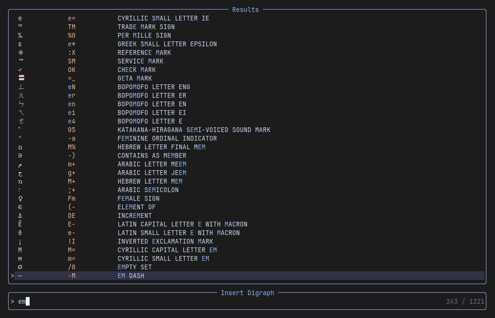

# Digraph Picker

A Neovim plugin for browsing and inserting digraphs. The plugin can be configured with custom digraphs.



## Installation

- Download and install from the Github [srackham/digraph-picker.nvim](https://github.com/srackham/digraph-picker.nvim) repo using your preferred Neovim plugin installer.
- Create a keyboard mapping to invoke the digraph picker e.g.

        vim.keymap.set({ 'i', 'n' }, '<C-k><C-k>', require('digraph-picker').insert_digraph,
          { noremap = true, silent = true, desc = "Digraph picker" })

### LazyVim Configuration
If you use the [LazyVim](https://www.lazyvim.org/) package manager:

1. Create a Lua file (e.g. `digraph-picker.lua`) in the plugins configuration directory (normally `~/.config/nvim/lua/plugins/` on Linux) and add the following code:
   ```lua
   return {
     'srackham/digraph-picker.nvim',
     dependencies = {
       'nvim-telescope/telescope.nvim',
     },
     version = '*', -- Install latest tagged version
     config = function()
       local picker = require('digraph-picker')
       picker.setup()
       vim.keymap.set({ 'i', 'n' }, '<C-k><C-k>', picker.insert_digraph,
         { noremap = true, silent = true, desc = "Digraph picker" })
     end,
   }
   ```
2. Restart Neovim. LazyVim will detect the new plugin file and install it from Github.

### Digraph customisation
New digraphs can be added and builtin digraphs can be customised using the `setup` function `digraphs` option. The following example adds _Umbrella_ and _Flag_ digraphs and modifies the builtin _Pilcrow_ digraph:

```lua
local picker = require('digraph-picker')
picker.setup({
  digraphs = {
    { digraph = 'um', symbol = '☂', name = 'Umbrella' },
    { digraph = 'fl', symbol = '⚑', name = 'Flag' },
    { digraph = 'pp', symbol = '¶', name = 'Pilcrow (paragraph sign)' },
  },
})
```

The rules for merging digraph definitions into the builtin digraph table are:

- If the builtin digraph table contains a definition with the same `symbol` then non-nil `digraph` and `name` fields are updated in the builtin definition.
- If the builtin table does not contain a definition matching `symbol` then the new definition is added to the builtin table.

Custom digraphs added with the `setup` function are also added to the Neovim internal digraph table and can be entered with the native Vim `CTRL-K {char1} {char2}` command.

The builtin digraphs table can be completely excluded by setting the `exclude_builtin_digraphs` setup option to `true`.

## Usage

- Press `<C-k><C-k>` (or whatever mapping you created) then search for and select a digraph from the picker.
- The recommended `<C-k><C-k>` digraph picker key mapping plays nicely with the native Vim `CTRL-K {char1} {char2}` digraph command.
- The convention of normal character case for the names of custom digraphs makes it easy to distinguish them from Vim's built in digraphs.

## Implementation

- The builtin digraph definitions were copied from the Vim `digraph.txt` help file (see the `:h digraph.txt` command).

## Todo

- Document the API.
- Add Vim help command documentation.
